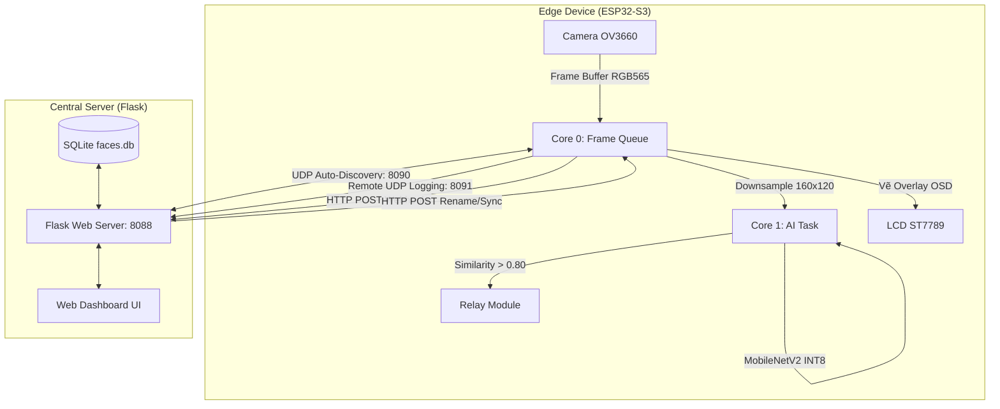

# Hệ Thống Nhận Diện Khuôn Mặt Điểm Danh Thời Gian Thực (Edge AI) Sử Dụng ESP32-S3

Hệ thống điểm danh và kiểm soát ra vào thông minh tích hợp nhận diện khuôn mặt thời gian thực xử lý trực tiếp tại thiết bị biên (Edge AI) sử dụng SoC **ESP32-S3**. Dự án bao gồm thiết bị nhúng biên chạy FreeRTOS kết nối bất đồng bộ với Máy chủ quản lý trung tâm (Flask Web Dashboard + SQLite DB) thông qua mạng Wi-Fi nội bộ LAN.

---

## 🚀 Tính Năng Nổi Bật

### 1. Xử lý Trí tuệ Nhân tạo tại Biên (Edge AI)
*   **Pipeline AI Tối ưu:** Quy trình `Camera Capture (OV3660) -> Skip Logic Downsampling (160x120) -> Face Detection (ESP-DL) -> Feature Extraction (MobileNetV2 INT8) -> Cosine Similarity Matching` chạy song song bất đồng bộ trên FreeRTOS.
*   **Dual-Core Parallelism:** Chia lõi xử lý độc lập: Core 0 đảm nhiệm chụp ảnh camera, hiển thị LCD ST7789 và quản lý kết nối mạng; Core 1 chuyên trách chạy các tác vụ suy luận AI.
*   **Chuẩn hóa Vector L2 An toàn (Safe L2 Normalization):** Tự động phát hiện và sửa lỗi giá trị `nan` phát sinh do phép chia cho magnitude quá nhỏ hoặc lỗi rác số mũ lượng hóa từ Flash NVS.

### 2. Giao Tiếp & Kết Nối Tự Động (UDP Auto-Discovery)
*   **Khám Phá IP Tự Động:** Thiết bị nhúng tự phát gói tin Broadcast UDP (port 8090) để tìm kiếm IP máy chủ Flask trong mạng LAN, loại bỏ hoàn toàn việc cấu hình địa chỉ IP tĩnh thủ công.
*   **Đồng Bộ Hai Chiều (Dynamic Sync):** Hỗ trợ gọi API HTTP GET `/api/faces` từ Server để đồng bộ danh sách ID - Name lưu trữ trong NVS Flash biên khi khởi động.
*   **Chuyển Tiếp Log Không Dây (Remote Logging):** Cấu hình đè hàm `esp_log_set_vprintf` của ESP-IDF để truyền tải toàn bộ log gỡ lỗi qua cổng UDP 8091 về Web Dashboard hiển thị thời gian thực.

### 3. Đóng Gói Cơ Khí & Phần Cứng Ổn Định
*   **Mạch Lọc Nguồn Chống Sụt Áp (Voltage Sag Protection):** Tích hợp tụ hóa lọc nguồn lớn \(1000\,\mu\text{F}\) song song nguồn cấp 5V và diode \(1\text{N}4007\) dập xung ngược để loại bỏ nhiễu điện cảm từ Relay, ngăn ngừa lỗi Brownout Reset vi điều khiển.
*   **Vỏ Hộp Thiết Kế CAD/In 3D:** Thiết kế vỏ bảo vệ tối ưu bằng nhựa PLA, có sẵn các khe thoát nhiệt và khớp vừa khít cho ống kính camera, màn hình LCD và cổng sạc.
*   **Đăng Ký Nhanh Trực Tiếp (Local Enroll):** Hỗ trợ nhấn đúp nút BOOT (GPIO 0) để tự động chụp ảnh, trích xuất đặc trưng và đẩy ảnh gốc JPEG về Server.

---

## 🛠️ Kiến Trúc Hệ Thống



---

## 📐 Thông Số Kết Nối Phần Cứng (GPIO Map)

| Linh Kiện | Chân Tín Hiệu | Chân GPIO trên ESP32-S3 | Ghi Chú |
| :--- | :--- | :--- | :--- |
| **Camera OV3660** | D0 - D7 | GPIO 11, 9, 8, 10, 12, 18, 17, 16 | Bus dữ liệu DVP 8-bit |
| | XCLK / PCLK | GPIO 15 / GPIO 13 | Xung nhịp hệ thống / pixel |
| | VSYNC / HREF | GPIO 6 / GPIO 7 | Xung đồng bộ dòng / cột |
| | SIOD / SIOC | GPIO 4 / GPIO 5 | Giao tiếp điều khiển SCCB |
| **LCD ST7789** | MOSI / CLK | GPIO 38 / GPIO 47 | Giao tiếp SPI2_HOST |
| | CS / DC / RST | GPIO 41 / GPIO 39 / GPIO 40 | Chân chọn chip / dữ liệu / reset |
| | Backlight | GPIO 14 | Điều khiển độ sáng đèn nền |
| **Relay Lock** | Control Pin | GPIO 2 | Mức HIGH kích mở khóa, LOW đóng |
| **BOOT Button** | Input | GPIO 0 | Nút bấm vật lý tích hợp sẵn |

---

## 📊 Kết Quả Đạt Được & Hiệu Năng Thực Tế

### 1. Đánh giá độ chính xác theo khoảng cách quét
Hệ thống hoạt động lý tưởng nhất ở khoảng cách từ 0.5m đến 1.25m với độ chính xác đạt trên 88%. Khi khoảng cách vượt quá 1.5m, tỷ lệ chính xác giảm do kích thước khuôn mặt trên camera nhỏ hơn mức tối thiểu của mô hình.

| Khoảng cách (m) | Số lượt thử nghiệm | Số lượt chính xác | Tỷ lệ chính xác (%) | Thời gian xử lý trung bình (ms) |
| :--- | :---: | :---: | :---: | :---: |
| 0.50 | 100 | 97 | 97.0% | 2710 |
| 0.75 | 100 | 95 | 95.0% | 2725 |
| 1.00 | 100 | 92 | 92.0% | 2731 |
| 1.25 | 100 | 88 | 88.0% | 2740 |
| 1.50 | 100 | 78 | 78.0% | 2755 |
| 1.75 | 100 | 62 | 62.0% | 2790 |
| 2.00 | 100 | 45 | 45.0% | 2850 |

### 2. Đánh giá hiệu năng theo điều kiện ánh sáng
Tỷ lệ nhận diện đúng đạt tối ưu (\(>92\%\)) trong điều kiện ánh sáng tự nhiên và ánh sáng trong phòng. Khi thiếu sáng hoàn toàn, đèn LED trợ sáng kích hoạt qua lệnh giúp khôi phục tỷ lệ nhận diện lên mức khá (\(88\%\)).

| Điều kiện ánh sáng | Phát hiện mặt (%) | Nhận diện đúng (%) | Tỷ lệ FAR (%) | Tỷ lệ FRR (%) |
| :--- | :---: | :---: | :---: | :---: |
| Đủ sáng tự nhiên (300-500 lux) | 100.0% | 96.0% | 0.2% | 3.8% |
| Ánh sáng huỳnh quang (150-300 lux)| 99.0% | 92.0% | 0.5% | 7.5% |
| Ngược sáng mạnh (Backlight) | 92.0% | 82.0% | 1.2% | 16.8% |
| Thiếu sáng có LED trợ sáng | 95.0% | 88.0% | 0.8% | 11.2% |
| Thiếu sáng không LED (< 20 lux) | 48.0% | 35.0% | 4.5% | 60.5% |

---

## 💻 Hướng Dẫn Cài Đặt & Chạy Hệ Thống

### 1. Chuẩn Bị Môi Trường
*   Cài đặt **ESP-IDF v4.4** hoặc **v5.0+** từ Espressif.
*   Cài đặt Python 3.9+ trên máy chủ trung tâm.
*   Cài đặt các gói phụ thuộc cho Python:
    ```bash
    pip install Flask requests pillow openpyxl matplotlib
    ```

### 2. Chạy Máy Chủ Trung Tâm (Flask Server)
1.  Di chuyển vào thư mục server:
    ```bash
    cd Source/FaceRecognitionS3/server
    ```
2.  Khởi chạy máy chủ:
    ```bash
    python main.py
    ```
    *Giao diện Web Dashboard sẽ chạy tại địa chỉ: `http://<IP_PC>:8088`*

### 3. Biên Dịch & Nạp Chương Trình ESP32-S3
1.  Di chuyển vào thư mục mã nguồn firmware:
    ```bash
    cd Source/FaceRecognitionS3
    ```
2.  Cấu hình Wi-Fi SSID và Mật khẩu trong menuconfig:
    ```bash
    idf.py menuconfig
    ```
    *(Cấu hình Wi-Fi SSID tại mục `Example Connection Configuration`)*
3.  Biên dịch và nạp chương trình:
    ```bash
    idf.py build flash monitor
    ```

---

## 📌 Hướng dẫn thao tác nhanh qua nút BOOT (GPIO 0)
*   **Nhấn đơn (Single Click):** Bật/Tắt chế độ nhận dạng trực tuyến.
*   **Nhấn đúp (Double Click):** Bật chế độ đăng ký khuôn mặt nhanh (Auto Enroll) cho thành viên mới (lưu tên mặc định `User_<ID>`).
*   **Nhấn giữ 2 giây (Long Press):** Xóa sạch toàn bộ cơ sở dữ liệu khuôn mặt đã lưu trong Flash LittleFS.
