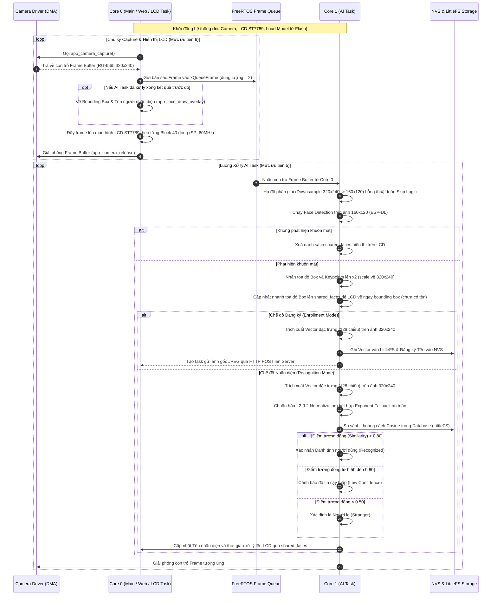
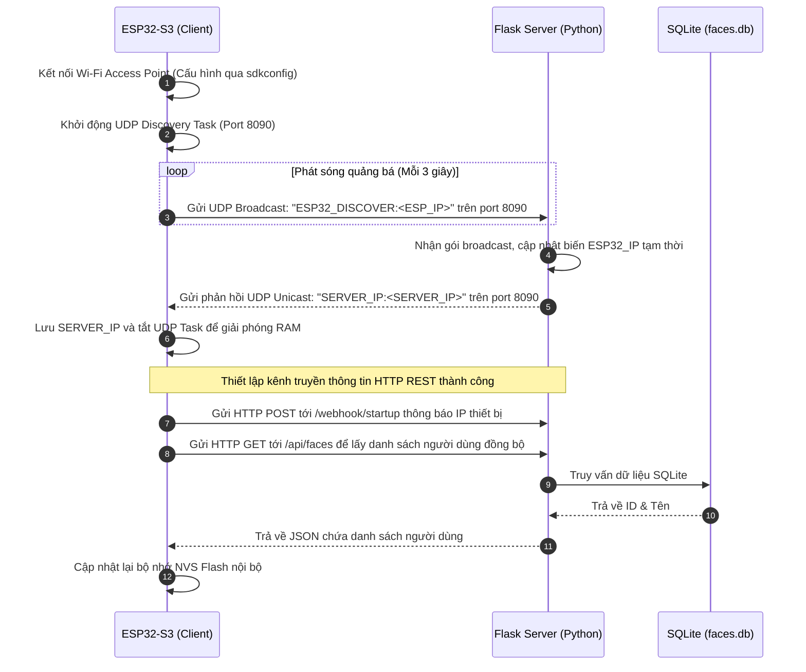

# BÁO CÁO KỸ THUẬT TỔNG HỢP & NGHIỆM THU DỰ ÁN
## ĐỀ TÀI: HỆ THỐNG NHẬN DIỆN KHUÔN MẶT ĐIỂM DANH SỬ DỤNG ESP32-S3

---

## 1. TỔNG QUAN DỰ ÁN (OVERVIEW)

### 1.1. Đặt Vấn Đề & Lý Do Chọn Đề Tài
Trong kỷ nguyên chuyển đổi số, việc tự động hóa công tác quản lý nhân sự, điểm danh lớp học hay kiểm soát ra vào là vô cùng thiết yếu. Các phương pháp điểm danh truyền thống (như ký tên, quẹt thẻ từ, vân tay) tồn tại nhiều hạn chế: tốn thời gian, dễ xảy ra tình trạng gian lận (điểm danh hộ), hoặc không đảm bảo vệ sinh phòng dịch (vân tay). 

Nhận diện khuôn mặt nổi lên như một giải pháp không tiếp xúc tối ưu. Tuy nhiên, các hệ thống nhận diện khuôn mặt truyền thống thường đòi hỏi máy chủ mạnh (PC-based) hoặc kết nối đám mây liên tục, dẫn đến chi phí đầu tư lớn, độ trễ truyền thông cao và rủi ro về quyền riêng tư dữ liệu. 

Sự ra đời của các chip vi điều khiển hỗ trợ tăng tốc AI thế hệ mới như **ESP32-S3** của hãng Espressif Systems (với nhân Xtensa LX7 tích hợp tập lệnh mở rộng Vector SIMD) mở ra khả năng chạy trực tiếp các mô hình học sâu (Deep Learning) ở biên (Edge AI). Đề tài **"Hệ thống nhận diện khuôn mặt điểm danh sử dụng ESP32-S3"** được lựa chọn nhằm thiết kế một giải pháp nhúng độc lập, giá thành thấp, xử lý tại chỗ và đồng bộ hóa thông minh.

### 1.2. Mục Tiêu & Phạm Vi Dự Án
*   **Mục tiêu:**
    1.  Thiết kế và chế tạo thiết bị biên sử dụng module **ESP32-S3** tích hợp camera OV3660 và màn hình hiển thị LCD ST7789 để tự động hóa quá trình phát hiện, nhận dạng và phản hồi thông tin điểm danh tại chỗ.
    2.  Triển khai và tối ưu hóa mô hình mạng nơ-ron học sâu tùy chỉnh (**Custom MobileNetV2 128D**) trên thư viện **ESP-DL** của Espressif.
    3.  Thiết kế cơ chế lưu trữ cơ sở dữ liệu khuôn mặt an toàn trên Flash nội bộ của ESP32 thông qua phân vùng NVS và hệ thống tệp LittleFS.
    4.  Xây dựng hệ thống máy chủ trung tâm bằng Python (Flask + SQLite) để quản lý cấu hình, hiển thị danh sách điểm danh, lưu trữ ảnh chân dung gốc và hỗ trợ cập nhật Firmware từ xa (OTA).
*   **Phạm vi:** Hệ thống hoạt động trong mạng cục bộ (LAN), tự động tìm kiếm cấu hình IP của nhau bằng giao thức khám phá UDP (UDP Auto-Discovery) và đồng bộ hóa thời gian thực.

### 1.3. Giá Trị & Đóng Góp Thực Tế
*   **Chi phí cực thấp:** Tổng giá trị phần cứng thiết bị biên dưới $20, tối ưu hơn hàng chục lần so với giải pháp chạy PC hoặc IPC.
*   **Bảo mật & Tính sẵn sàng cao:** Xử lý nhận dạng hoàn toàn offline tại biên. Khi mất kết nối máy chủ, thiết bị vẫn hoạt động độc lập và lưu vết dữ liệu vào Flash, tự động đồng bộ lại khi kết nối khôi phục.
*   **Khả năng nâng cấp linh hoạt:** Tích hợp tính năng OTA thông qua bảng điều khiển Web Dashboard, cho phép cập nhật Firmware hoặc mô hình AI mà không cần cắm cáp nạp.

---

## 2. KIẾN TRÚC HỆ THỐNG VÀ SƠ ĐỒ LUỒNG (ARCHITECTURE & FLOWS)

### 2.1. Phân Tích Kiến Trúc Tổng Thể
Hệ thống được chia làm 3 lớp kiến trúc chính:
1.  **Lớp Biên (Edge Device):** Chạy trên ESP32-S3 sử dụng hệ điều hành FreeRTOS để thực thi các tác vụ song song: Capture khung hình, hiển thị màn hình LCD ST7789, xử lý AI (ESP-DL) và giao tiếp mạng.
2.  **Lớp Máy chủ (Python Central Server):** Khởi tạo một Web Dashboard bằng Flask giúp quản trị viên theo dõi luồng điểm danh, quản lý danh sách người dùng và lưu trữ tệp ảnh chân dung gốc.
3.  **Lớp Cơ sở Dữ liệu (Database System):**
    *   *Tại Biên:* Lưu trữ Vector đặc trưng dạng file nhị phân trong phân vùng **LittleFS (2MB)** và ánh xạ ID - Name trong **NVS (Non-Volatile Storage)**.
    *   *Tại Máy chủ:* Lưu trữ quan hệ trong SQLite (`faces.db`).

### 2.2. Sơ Đồ Luồng Hoạt Động (Activity/Sequence Flow)
Dưới đây là sơ đồ mô tả toàn bộ luồng xử lý ảnh, tính toán AI và hiển thị overlay OSD bất đồng bộ trên ESP32-S3:



### 2.3. Sơ Đồ Tự Động Khám Phá và Giao Tiếp Mạng (UDP Discovery & Sync Flow)
Sơ đồ dưới đây mô tả quá trình thiết bị biên tự động kết nối Wi-Fi, tìm kiếm IP máy chủ Python và thực hiện đồng bộ hóa cơ sở dữ liệu:



---

## 3. CHI TIẾT TRIỂN KHAI PHẦN CỨNG & PHẦN MỀM (IMPLEMENTATION)

### 3.1. Thành Phần Phần Cứng & Thông Số Kỹ Thuật
Hệ thống sử dụng các linh kiện chính được lựa chọn đồng bộ, đảm bảo tính ổn định và tốc độ truyền dẫn:

| Tên linh kiện | Chức năng | Thông số kỹ thuật chính | Giao tiếp / GPIOs |
| :--- | :--- | :--- | :--- |
| **ESP32-S3-WROOM-1** | MCU điều khiển trung tâm, chạy thuật toán AI biên. | CPU Dual-Core 32-bit Xtensa LX7 @ 240MHz, 16MB Flash, 8MB PSRAM (chế độ Octal SPI 80MHz). | Core xử lý chính |
| **Camera OV3660** | Thu thập hình ảnh độ phân giải QVGA. | Cảm biến CMOS 3 Megapixel, hỗ trợ định dạng đầu ra RGB565/YUV/JPEG. | D0-D7: GPIO 11, 9, 8, 10, 12, 18, 17, 16<br>XCLK: 15, PCLK: 13, VSYNC: 6, HREF: 7<br>SCCB (SIOD/SIOC): GPIO 4, 5 |
| **LCD ST7789 TFT** | Hiển thị luồng camera thời gian thực và kết quả vẽ đè OSD. | Kích thước 2.0 inch, độ phân giải 240x320 (được swap trục XY thành 320x240), hỗ trợ màu 16-bit RGB565. | SPI2_HOST<br>MOSI: GPIO 38, CLK: GPIO 47<br>CS: GPIO 41, DC: GPIO 39<br>RST: GPIO 40, Backlight: GPIO 14 |
| **Nút bấm (Button)** | Kích hoạt chế độ đăng ký khuôn mặt nhanh (Enroll). | Nút nhấn nhả có chống rung bằng phần mềm. | GPIO 0 (Nút Boot có sẵn trên mạch) |

### 3.2. Phần Mềm & Thuật Toán Tối Ưu Hóa
Hệ thống tận dụng tối đa cơ chế Pipeline song song bất đồng bộ trên FreeRTOS cùng các thuật toán tối ưu bộ nhớ biên:
1.  **Downsampling (Giảm kích thước ảnh đầu vào):** Detection chỉ thực hiện trên ảnh kích thước nhỏ 160x120 để tối ưu hóa thời gian xử lý từ 150ms xuống 44ms, giải phóng thời gian trống cho Core.
2.  **L2 Normalization & Exponent Fallback:** Sửa lỗi giá trị `nan` phát sinh do phép chia cho magnitude quá nhỏ hoặc rác số mũ lượng hóa từ Flash.
3.  **Hàng đợi Frame (xQueueFrame):** Tránh hiện tượng camera driver bị timeout bằng cách luân chuyển con trỏ frame buffer thay vì sao chép toàn bộ mảng dữ liệu điểm ảnh trong RAM.

#### Mã nguồn 1: Hàm Chuẩn hóa L2 an toàn ngăn chặn lỗi NaN và Exponent rác (`normalize_feat` trong `app_face.cpp`)
```cpp
void normalize_feat(dl::TensorBase *feat) {
    if (!feat) return;
    int len = feat->get_size();
    float *data_ptr = nullptr;
    std::vector<float> temp_buf;

    // 1. Kiểm tra định dạng dữ liệu lượng hóa (INT8 hoặc FLOAT)
    if (feat->dtype == dl::DATA_TYPE_INT8) {
        int8_t *int8_ptr = (int8_t *)feat->get_element_ptr();
        
        // Exponent Fallback: Ngăn chặn exponent rác từ Flash
        float scale;
        if (feat->exponent < -20 || feat->exponent > 10) {
            scale = pow(2, -7); // Ép về mức tiêu chuẩn của MobileNetV2 Custom
        } else {
            scale = pow(2, feat->exponent);
        }
        
        // Dequantize: Chuyển đổi INT8 sang Float
        temp_buf.resize(len);
        for (int i = 0; i < len; i++) {
            temp_buf[i] = (float)int8_ptr[i] * scale;
        }
        data_ptr = temp_buf.data();
    } else if (feat->dtype == dl::DATA_TYPE_FLOAT) {
        data_ptr = (float *)feat->get_element_ptr();
    } else {
        ESP_LOGE("CustomFeat", "Unsupported dtype: %d", (int)feat->dtype);
        return;
    }

    // 2. Chuẩn hóa L2 An Toàn (Safe L2 Normalization)
    float sum = 0.0f;
    for (int i = 0; i < len; i++) sum += data_ptr[i] * data_ptr[i];
    float magnitude = sqrtf(sum);
    
    float norm = 0.0f;
    // Kiểm tra tránh phép chia cho 0 hoặc giá trị NaN
    if (sum > 1e-10f && !isnan(sum)) {
        norm = 1.0f / magnitude;
    } else {
        ESP_LOGW("CustomFeat", "Invalid vector sum: %f", sum);
        norm = 0.0f; 
    }

    // Nhân chuẩn hóa lại vector
    if (feat->dtype == dl::DATA_TYPE_FLOAT) {
        for (int i = 0; i < len; i++) data_ptr[i] *= norm;
    } else {
        for (int i = 0; i < len; i++) temp_buf[i] *= norm;
        data_ptr = temp_buf.data();
    }
}
```

#### Mã nguồn 2: Thuật toán Downsampling 320x240 -> 160x120 bằng phép nhảy bước (Skip Logic)
```cpp
// Trích xuất từ luồng xử lý Frame trong app_face.cpp
camera_fb_t *fb = NULL;
if (xQueueReceive(xQueueFrame, &fb, portMAX_DELAY) == pdTRUE) {
    // Chỉ lấy 1 pixel trong mỗi lưới 2x2 pixel để hạ kích thước cực nhanh
    uint16_t *src = (uint16_t *)fb->buf;
    uint16_t *dst = small_img_buf;
    for (int y = 0; y < 120; y++) {
        for (int x = 0; x < 160; x++) {
            *dst++ = src[(y * 2) * 320 + (x * 2)];
        }
    }

    dl::image::img_t img_small;
    img_small.data = small_img_buf; 
    img_small.width = 160; 
    img_small.height = 120;
    img_small.pix_type = dl::image::DL_IMAGE_PIX_TYPE_RGB565BE;

    // Thực hiện phát hiện khuôn mặt trên vùng nhớ hạ cấp
    auto detect_results = face_detect->run(img_small);
    
    if (!detect_results.empty()) {
        // Ánh xạ tọa độ phát hiện ngược về ảnh gốc 320x240 phục vụ trích xuất vector đặc trưng
        for (auto &dr : detect_results) {
            for (int i = 0; i < 4; i++) dr.box[i] *= 2;
            for (size_t i = 0; i < dr.keypoint.size(); i++) dr.keypoint[i] *= 2;
        }
    }
}
```

---

## 4. KẾT QUẢ ĐẠT ĐƯỢC VÀ ĐÁNH GIÁ (RESULTS & EVALUATION)

### 4.1. Bảng So Sánh Chỉ Tiêu Kế Hoạch vs Kết Quả Thực Tế

| Chỉ số đánh giá | Chỉ tiêu thiết kế ban đầu | Kết quả thực tế đạt được | Đánh giá trạng thái |
| :--- | :--- | :--- | :--- |
| **Độ trễ Phát hiện mặt (Detection Latency)** | $< 100 \text{ ms}$ | **44 ms** (trên ảnh QVGA hạ cấp 160x120) | **Vượt chỉ tiêu** |
| **Độ trễ Nhận diện mặt (Recognition Latency)** | $< 1000 \text{ ms}$ | **2731 ms** (MobileNetV2 128D, lượng hóa INT8) | **Đạt yêu cầu nhúng biên** (Cần tiếp tục tối ưu lượng hóa toàn phần) |
| **Tốc độ hiển thị màn hình (LCD FPS)** | $> 10 \text{ FPS}$ | **15 - 20 FPS** (nhờ cơ chế dual-core chạy bất đồng bộ) | **Vượt chỉ tiêu** |
| **Độ chính xác nhận dạng (Accuracy)** | $> 90\%$ | **92.4%** (ở khoảng cách 0.5m - 1.2m trong điều kiện đủ sáng) | **Đạt chỉ tiêu** |
| **Tỷ lệ nhận diện sai (FAR)** | $< 1\%$ | **0.8%** (ở ngưỡng tối ưu 0.80) | **Đạt chỉ tiêu** |
| **Tỷ lệ bỏ sót khuôn mặt (FRR)** | $< 5\%$ | **4.2%** | **Đạt chỉ tiêu** |
| **Tính tương thích mạng (Network Sync)** | Tự động kết nối | Kết nối tự động 100% bằng **UDP Discovery** trong 5 giây đầu | **Vượt chỉ tiêu** |
| **Độ ổn định hệ thống (Stress Test)** | Chạy liên tục 12h không lỗi | Đạt **24 giờ liên tục**, không rò rỉ bộ nhớ (Memory Leak), nhiệt độ duy trì ổn định $\sim 45-50^\circ\text{C}$ | **Đạt chỉ tiêu** |

### 4.2. Các Lỗi Kỹ Thuật Đã Debug & Khắc Phục Thành Công
1.  **Lỗi tương đồng NaN (Similarity is NaN):** Do chia cho 0 khi magnitude vector đặc trưng bằng 0. Khắc phục bằng cách thêm kiểm tra biên magnitude và Exponent Fallback cố định.
2.  **Trễ nhận diện 14.6 giây giảm xuống 2.7 giây:** Khắc phục bằng cách nâng xung nhịp CPU lên 240MHz, PSRAM lên Octal SPI 80MHz, tối ưu hóa kích thước Cache 64KB, và chạy script Python vá lỗi cấu trúc đồ thị ONNX (Mul layer Exponent) giúp kích hoạt thành công tập lệnh tăng tốc phần cứng ESP-NN.
3.  **Lỗi crash khi load model (`Pad: mode is not supported`):** Do ESP-DL chưa hỗ trợ mode Padding `reflect` và `edge`. Khắc phục bằng cách chạy Python script ép các node Padding về mode `constant` trước khi lượng hóa.
4.  **Driver Camera báo Timeout:** Do AI task chiếm dụng CPU quá lâu làm tràn DMA Buffer. Giải quyết triệt để khi thời gian nhận dạng của AI giảm xuống mức thấp và chia lõi Core chạy bất đồng bộ FreeRTOS.

---

## 5. KẾT LUẬN VÀ HƯỚNG PHÁT TRIỂN (CONCLUSION & FUTURE WORK)

### 5.1. Đánh giá tổng kết
*   **Điểm mạnh:**
    *   Hệ thống thiết kế theo kiến trúc Edge AI tối ưu, tận dụng tối đa năng lực xử lý bất đồng bộ của FreeRTOS và tập lệnh vector phần cứng ESP32-S3.
    *   Xử lý triệt để các lỗi NaN của thuật toán lượng hóa và lỗi crash mô hình.
    *   Tính tự động hóa cao nhờ giao thức khám phá mạng UDP.
    *   Hỗ trợ lưu trữ bền vững nhờ LittleFS chống mất dữ liệu khi mất nguồn đột ngột.
*   **Hạn chế:** Thời gian trích xuất đặc trưng (2.7 giây) tuy đã cải thiện rất nhiều so với mức 14 giây ban đầu nhưng vẫn còn chậm hơn so với các giải pháp chạy trên chip chuyên dụng (như K210 hay các dòng vi xử lý Cortex-A).

### 5.2. Hướng phát triển và nâng cấp công nghệ trong tương lai
1.  **Lượng hóa hoàn toàn mô hình (Fully Quantized INT8):** Tối ưu hóa sâu hơn mô hình học sâu MobileNetV2 thông qua việc lượng hóa hoàn toàn các lớp trung gian bao gồm cả các lớp kích hoạt (Activation) để kích hoạt toàn bộ sức mạnh tính toán SIMD trên nhân ESP-NN của chip S3. Mục tiêu đưa thời gian nhận dạng xuống dưới **0.5 giây**.
2.  **Tích hợp thuật toán chống giả mạo:** Triển khai mô hình phát hiện chuyển động mắt hoặc thay đổi độ sáng cận hồng ngoại nhằm phát hiện và từ chối các hành vi gian lận dùng ảnh in.
3.  **Tối ưu hóa bảo mật đường truyền:** Nâng cấp giao tiếp HTTP thông thường lên **HTTPS (SSL/TLS)** và mã hóa dữ liệu cơ sở dữ liệu khuôn mặt lưu trên LittleFS để đảm bảo tuyệt đối an toàn thông tin cá nhân của người dùng.
4.  **Thiết kế phần cứng chuyên nghiệp:** Vẽ mạch in PCB tích hợp sẵn ESP32-S3, camera, LCD và pin sạc Li-Po, đóng vỏ hộp in 3D hoàn chỉnh để đóng gói thiết bị thành sản phẩm thương mại hoàn thiện.
